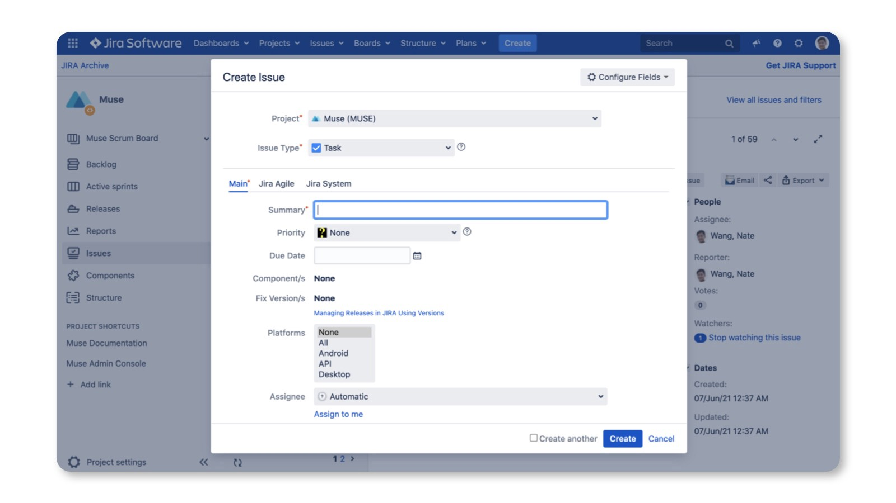

# React modal windows

## Motivation
_This part is taken from [the great alternative library](https://github.com/eBay/nice-modal-react/) 
, which solves the exactly same problem in a bit different way._

_The library is definitely worth a look._ 
<hr>
Using modals in React is a bit frustrating. Think of that if you need to implement 
below UI:



The dialog is used to create a JIRA ticket. It could be shown from many places, 
from the header, to the context menu, to the list page. Traditionally, we had 
declared modal components with a JSX tag. But then the question became, “Where 
should we declare the tag?”

The most common option was to declare it wherever it was being used. But using 
modals in a declarative way is not only about a JSX tag, but also about maintaining 
the modal’s state like visibility, parameters in the container component. Declaring 
it everywehre means managing state everywhere. It's frustrating.

The other option put it in the Root component, for example:

```jsx
const Root = () => {
  const [visible, setVisible] = useState(false);
  // other logic ...
  return (
    <>
      <Main />
      <NewTicketModal visible={visible} />
    </>
  );
}
```

However, when you declare the modal in the root component, there are some issues:

1. Not scalable. It's unreasonable to maintain the modal's state in the root 
1. component. When you need more modals you need to maintain much state, especially 
1. you need to maintain arguments for the modal.
1. It's hard to show or hide the modal from children components. When you maintain 
1. the state in a component then you need to pass `setVisible` down to the place 
1. where you need to show or hide the modal. It makes things too complicated.

Unfortunately, most examples of using modals just follow this practice, it causes 
such confusions when managing modals in React.

I believe you must once encountered with the scenario that originally you only 
needed to show a modal when click a button, then when requirements changed, you 
need to open the same modal from a different place. Then you have to refactor 
your code to re-consider where to declare the modal. The root cause of such 
annoying things is just because we have not understood the essential of a modal.

## Working with modals
To simplify this task and enhance the modularity of your code, we have created 
a custom hook called `useMuiModal`. This hook provides a clean and efficient way 
to create and manage modal windows. You can easily create and manipulate modal 
instances while keeping your code organized.

This documentation will guide you through the usage of `useMuiModal` in your 
React application.

_The described approach is just a wrapper built around the 
[mui-modal-provider](https://www.npmjs.com/package/mui-modal-provider) library._

### Basic usage
To get started, you can initialize a modal instance using the `useMuiModal` hook 
and provide the modal component you want to render. The hook returns three essential functions for managing your modal: openModal, closeModal, and updateCurrentModal.

Here's how you can create a modal instance:
```tsx
import useMuiModal from '../_core/hooks/use-mui-modal.hook.ts';
import YourModalComponent from './YourModalComponent';

const { openModal, closeModal, updateCurrentModal } = useMuiModal(YourModalComponent);
```
You can use the following functions to manage your modal instance:
- `openModal(initialProps)`: Opens the modal with initial properties. This function 
allows you to customize the modal's appearance when it is first opened.
- `closeModal()`: Closes the currently open modal.
- `updateCurrentModal(newProps)`: Updates the modal's properties, allowing you 
to change its content dynamically.

### Modifying Modal Content
You can use the `openModal` function to open the modal with an initial set of parameters. 

For example:
```tsx
openModal({ closeDisabled: true, header: 'Demo title' });
```

You can also update the modal instance with new properties using the `updateCurrentModal` function:
```tsx
updateCurrentModal({ closeDisabled: false });
```

### Modal components definition
If you prefer the traditional way of declaring modals in React, you can continue 
to do so. `useMuiModal` does not restrict you from creating modals in this way. 
Basically, it controls modal windows by utilizing the `open` property and `onClose` 
method, as we usually do for declarative-styled modals.

So any of such modals can be used in `tsx` code, in a regular way (_still better to avoid_).

### Example
Here's a complete example to illustrate how to use `useMuiModal` in a React 
component:
```tsx
import React from 'react';
import useMuiModal from '@your-package/useMuiModal';
import YourModalComponent from './YourModalComponent';

function App() {
  const { openModal, closeModal, updateCurrentModal } = useMuiModal(YourModalComponent);

  const handleOpenModal = () => {
    openModal({ closeDisabled: true, header: 'Demo title' });
  };

  const handleUpdateModal = () => {
    updateCurrentModal({ closeDisabled: false });
  };

  return (
    <div>
      <button onClick={handleOpenModal}>Open Modal</button>
      <button onClick={handleUpdateModal}>Update Modal</button>
      <button onClick={closeModal}>Close Modal</button>
    </div>
  );
}

export default App;
```
